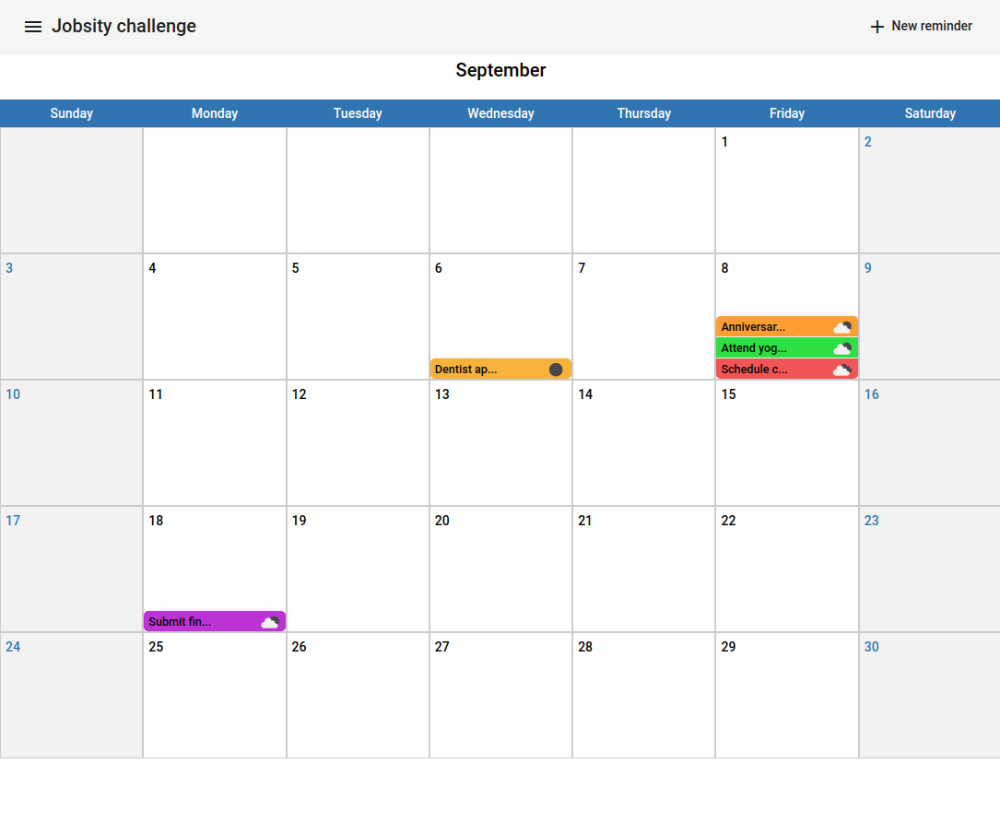
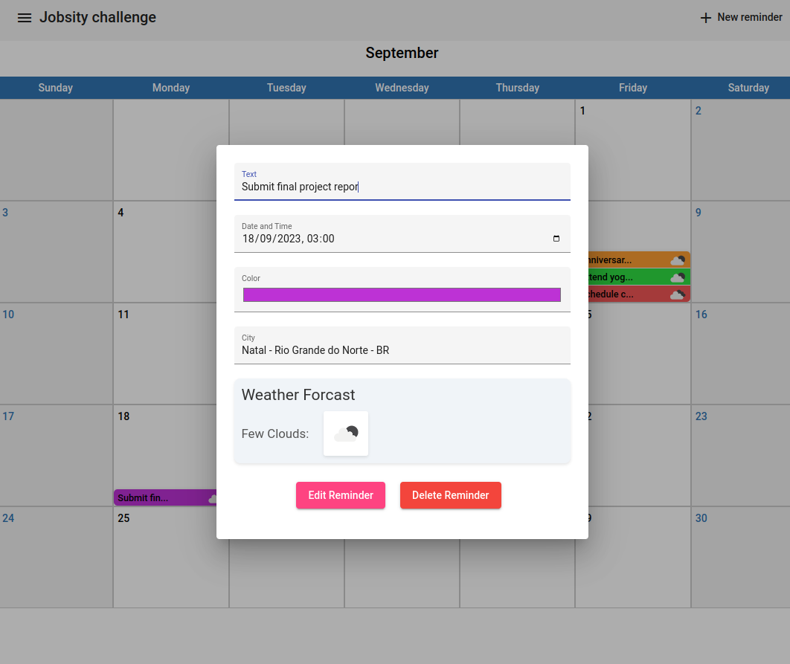

# Angular Calendar Application

## Overview

This project is a custom-built Angular calendar application that allows users to add reminders to specific dates. It integrates with the OpenWeatherMap API to provide weather forecasts for the selected cities on the chosen dates. The application utilizes UUID for generating unique identifiers and leverages NgRx for state management, enhancing the efficiency and performance of the application.

## Features

### Custom-Built Calendar
The calendar component is built from scratch, providing a seamless and integrated user experience. Users can navigate through months and select specific dates to view or add reminders.

### Reminders
Users can add reminders to specific dates, including details such as:
- Reminder text (with a maximum of 30 characters)
- Date and time
- Color
- City

### Weather Forecast Integration
When a city is selected while creating a reminder, the application fetches the weather forecast for that city on the selected date using the OpenWeatherMap API, providing users with a glimpse of the expected weather conditions.

### State Management with NgRx
The application utilizes NgRx, a robust framework for managing state and interactions in Angular applications, facilitating predictable data flow and consistency throughout the application.

### UUID Integration
UUID is used to generate unique identifiers for each reminder, ensuring data integrity and enabling precise tracking and management of reminders.

### End-to-End Testing with Protractor
The application incorporates Protractor for end-to-end testing, ensuring the reliability and stability of the application through automated testing scripts that simulate user behavior and interactions.

## Getting Started

### Prerequisites

Before you begin, ensure you have met the following requirements:

- **Node**: >=12.11.1
- **NPM**: >=6.14.0
- **Angular**: >=9.1.0

### Installation Issues

If you encounter any issues during the installation process, you might try using the `--force` or `--legacy-peer-deps` flags as a workaround.

### Installation
1. Clone the repository to your local machine.
2. Navigate to the project directory.
3. Run `npm install` 
4. Run `ng serve` to start the development server.
5. Open your browser and navigate to `http://localhost:4200/` to access the application.

## Usage
1. **Adding a Reminder**: Click on the "New Reminder" button to add a new reminder. Fill in the details in the form and click "Create Reminder".
2. **Viewing Reminders**: Click on a date to view all reminders for that date.
3. **Editing a Reminder**: Click on a reminder to edit its details. Make the necessary changes and click "Edit Reminder".
4. **Deleting a Reminder**: Click on a reminder and then click "Delete Reminder" to remove it from the calendar.

## API Integration
The application integrates with the OpenWeatherMap API to fetch weather forecasts. You can find more details about the API [here](https://openweathermap.org/api).

## End-to-End Testing

To run the end-to-end tests with Protractor, follow these steps:

1. Ensure that your development server is not running, as the e2e tests will use the same port. You can stop the server using `Ctrl+C` in the terminal where `ng serve` was run.
2. Open a new terminal and navigate to the project directory.
3. Run `ng e2e` to execute the end-to-end tests. The tests will run and you will see the results in the terminal.

## Contributing
Feel free to fork the repository and submit pull requests. For major changes, please open an issue first to discuss what you would like to change.

## License
This project is licensed under the MIT License - see the LICENSE.md file for details.
